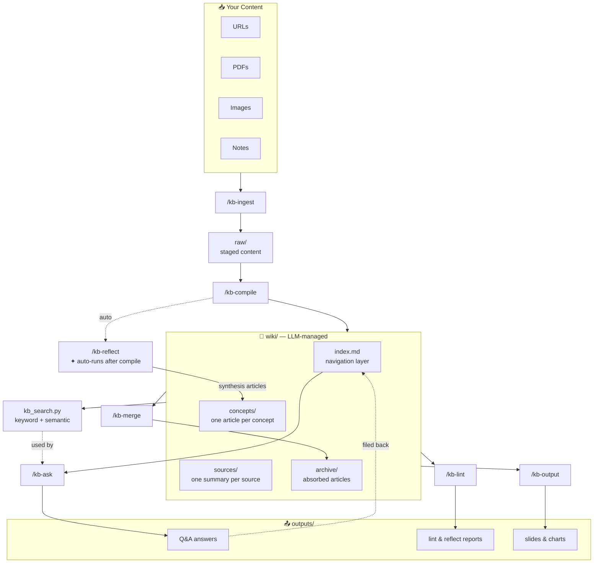

# LLM Knowledge Base

A self-managed personal knowledge base powered by [Claude Code](https://claude.ai/code). You feed it raw content — URLs, PDFs, images, notes — and the LLM handles all organization: tagging, summarizing, linking concepts, synthesizing connections, and answering questions. **You never edit the wiki directly.**

Uses **Obsidian** as the viewer and frontend.

---

## How It Works



The wiki grows smarter with every compile cycle. Q&A answers compound on each other. The LLM owns `wiki/` and `outputs/` — you own `raw/`.

---

## Prerequisites

| Requirement | Notes |
|---|---|
| [Claude Code](https://claude.ai/code) | Required — all skills run inside Claude Code |
| Claude subscription | A paid Anthropic plan (Pro or above) |
| [Obsidian](https://obsidian.md) | Free — used as the wiki viewer |
| Python 3.8+ | Required for the search tool |
| Git | Required — the KB directory is a git repo |

**Optional Python packages:**
```bash
pip install -r requirements.txt
```

---

## Quickstart

```bash
# 1. Clone this repo
git clone https://github.com/louiswang524/llm-knowledge-base.git
cd llm-knowledge-base

# 2. Run setup (pass your preferred KB location)
bash setup.sh ~/knowledge-base

# 3. Open ~/knowledge-base as a vault in Obsidian

# 4. Open Claude Code in any directory and start using the skills
```

`setup.sh` will:
- Create the KB directory structure
- Initialize it as a git repo
- Write `~/.claude/kb-config.json` pointing to your KB
- Copy all 7 skills into `~/.claude/skills/` so Claude Code can find them
- Copy `kb_search.py` into your KB directory

> **Note:** Skills are installed globally into `~/.claude/skills/`. You can use them from any Claude Code session, not just from the repo directory.

---

## Skills

### `/kb-import <vault-path>`

Import an existing Obsidian vault into the knowledge base. Inspects each note and routes it intelligently:

```
/kb-import ~/my-old-obsidian-vault
```

- **Concept articles** (structured, reference-style notes) → `wiki/concepts/` directly, preserving existing `[[wikilinks]]`
- **Raw research notes** (fleeting notes, source references, unstructured content) → `raw/notes/` for compilation

After import, prompts to run `/kb-compile` to process the raw notes.

---

### `/kb-merge-vault <vault-path>`

Merge a second KB vault into the current one.

```
/kb-merge-vault ~/knowledge-base-work
```

- Non-conflicting files are copied as-is
- Conflicting concept and source articles are auto-merged using LLM synthesis (same logic as `/kb-merge`)
- `manifest.json` and `wiki/index.md` are merged and deduplicated
- `reflect_state.json` is reset so the next `/kb-reflect` discovers connections across both vaults
- Prompts to run `/kb-reflect` after merging

---

### `/kb-ingest <source>`

Stage content into `raw/`. Does not compile yet.

```
/kb-ingest https://arxiv.org/abs/1706.03762
/kb-ingest /path/to/paper.pdf
/kb-ingest /path/to/diagram.png
/kb-ingest Self-attention allows each token to attend to all other tokens regardless of distance
```

| Input | Where it goes |
|---|---|
| URL (`http://` or `https://`) | `raw/web/` |
| `.pdf` file path | `raw/pdfs/` |
| Image path (`.png`, `.jpg`, `.jpeg`, `.gif`, `.webp`, `.svg`) | `raw/images/` |
| Anything else | `raw/notes/` |

Each file gets YAML frontmatter (`source`, `ingested_at`, `type`, `status: uncompiled`) and is registered in `.kb/manifest.json`.

---

### `/kb-compile`

Process all uncompiled `raw/` content into the wiki. Run after ingesting new content.

```
/kb-compile
```

For each uncompiled file, the LLM:
1. Writes a source summary to `wiki/sources/<slug>.md`
2. Creates or updates concept articles in `wiki/concepts/<concept>.md` with Obsidian `[[backlinks]]`
3. Appends entries to `wiki/index.md`
4. Updates `.kb/manifest.json` → `status: compiled`
5. Rebuilds the search index
6. Runs `/kb-reflect` automatically
7. Commits to git

Incremental — only processes new content. Safe to re-run.

---

### `/kb-ask <question>`

Ask a question against the wiki.

```
/kb-ask what is the attention mechanism?
/kb-ask how does RLHF relate to transformers?
/kb-ask summarize what we know about scaling laws
```

The LLM reads `wiki/index.md` first (never loads the full wiki), selects 3–5 relevant articles, synthesizes a grounded answer with `[[wiki-link]]` citations, and saves it to `outputs/`. Answers are indexed back into `wiki/index.md` so future queries compound on past ones.

---

### `/kb-reflect`

Discover non-obvious connections across the wiki and write synthesis articles. **Runs automatically after every `/kb-compile`.** Can also be run manually.

```
/kb-reflect
```

Two-stage process:
1. **Discovery** — reads `wiki/index.md` only, identifies 3–5 strongest connection candidates (cross-cutting themes, implicit relationships, contradictions, gaps)
2. **Synthesis** — deep-reads relevant articles per candidate, writes a new `type: synthesis` article to `wiki/concepts/` if evidence is strong

Output: synthesis articles + `outputs/YYYY-MM-DD-kb-reflect-report.md` summarizing what was found and suggesting follow-up ingestion.

---

### `/kb-merge <slug-a> <slug-b>` or `/kb-merge`

Merge duplicate or related concept articles.

```
# Explicit pair
/kb-merge attention attention-mechanism

# Auto-detect duplicates and confirm interactively
/kb-merge
```

For each merge: LLM synthesizes both articles into one clean merged article, all `[[backlinks]]` in `wiki/` and `outputs/` are updated, and the absorbed article is archived to `wiki/archive/` with a redirect note. One git commit per pair.

---

### `/kb-lint`

Run health checks on the wiki.

```
/kb-lint
```

Checks:
- **Thin articles** — concept articles with < 3 sentences
- **Missing concepts** — `[[concepts/X]]` links with no corresponding article
- **Broken wikilinks** — links pointing to non-existent files
- **Duplicate concepts** — near-duplicate concept slugs (feed these into `/kb-merge`)
- **New article suggestions** — wiki gaps + optional web search for missing details

Prints a terminal summary and saves a full report to `outputs/YYYY-MM-DD-kb-lint-report.md`.

---

### `/kb-output --slides <question|file>` or `/kb-output --chart <question|file>`

Render wiki content as a Marp slideshow or matplotlib chart.

```
# From a question (researches the wiki first)
/kb-output --slides what is the transformer architecture?
/kb-output --chart compare attention mechanisms across papers

# From an existing output file
/kb-output --slides outputs/2026-04-05-what-is-attention.md
```

- Slides → `outputs/YYYY-MM-DD-<slug>-slides.md` (view with the [Marp plugin](https://github.com/marp-team/marp) in Obsidian)
- Charts → `outputs/YYYY-MM-DD-<slug>-chart.png`

Requires: `pip install matplotlib networkx`

---

### Search Tool (`kb_search.py`)

Fast keyword + semantic search over the wiki. Installed into your KB directory by `setup.sh`. Claude uses this automatically during large queries; you can also run it directly.

```bash
# Rebuild index (automatic after /kb-compile)
python3 ~/knowledge-base/kb_search.py --rebuild

# Search
python3 ~/knowledge-base/kb_search.py "attention mechanism"
python3 ~/knowledge-base/kb_search.py "how do LLM agents work" --top 10
```

Output is JSON. Keyword search runs first; falls back to semantic search (sentence-transformers) if keyword confidence is low.

Requires: `pip install sentence-transformers` for semantic fallback (recommended).

---

## Directory Structure

```
~/knowledge-base/
├── raw/                       # staged source content (you feed this)
│   ├── web/                  # web articles as .md
│   ├── pdfs/                 # PDFs + extracted text sidecars
│   ├── images/               # images + description sidecars
│   └── notes/                # freeform text notes
├── wiki/                      # LLM-compiled knowledge (LLM owns this)
│   ├── index.md              # master index — one-line summary per article
│   ├── concepts/             # one .md per concept, with [[backlinks]]
│   ├── sources/              # one .md per raw source
│   └── archive/              # absorbed articles after /kb-merge
├── outputs/                   # Q&A answers, reports, slides, charts
├── kb_search.py               # search CLI tool
└── .kb/
    ├── manifest.json          # compilation state per raw file
    └── reflect_state.json     # last reflect timestamp + synthesized articles
```

---

## Typical Workflow

```
# Ingest a few sources
/kb-ingest https://lilianweng.github.io/posts/2023-06-23-agent/
/kb-ingest https://arxiv.org/abs/2005.14165
/kb-ingest My intuition: RLHF works because human preferences act as a soft constraint on the policy

# Compile — also triggers /kb-reflect automatically
/kb-compile

# Ask questions
/kb-ask what are the key components of an LLM agent?
/kb-ask how does RLHF relate to chain-of-thought?

# Periodically run health checks and merge duplicates
/kb-lint
/kb-merge
```

---

## What Claude Code Skills Are

Claude Code skills are plain markdown files that tell Claude how to behave when you type a trigger command (e.g. `/kb-ingest`). They live in `~/.claude/skills/` and are automatically available in every Claude Code session after installation. This repo ships 7 skills — `setup.sh` installs them all.

---

## Obsidian Tips

- Pin `wiki/index.md` as your home/dashboard note
- Use **Graph View** to visualize concept backlinks
- Use the **Backlinks panel** to see all sources that mention a concept
- Install the **[Marp](https://github.com/marp-team/marp)** plugin to preview `/kb-output --slides` results

---

## Contributing

Contributions welcome. To add or improve a skill:

1. Fork the repo
2. Edit or create a skill `.md` file in `skills/` (follow the existing format — frontmatter with `name`, `description`, `trigger`, then step-by-step instructions)
3. Test it by running `bash setup.sh` and invoking the skill in Claude Code
4. Open a PR with a description of what changed and why

Bug reports and feature requests: open an issue.

---

## License

MIT
